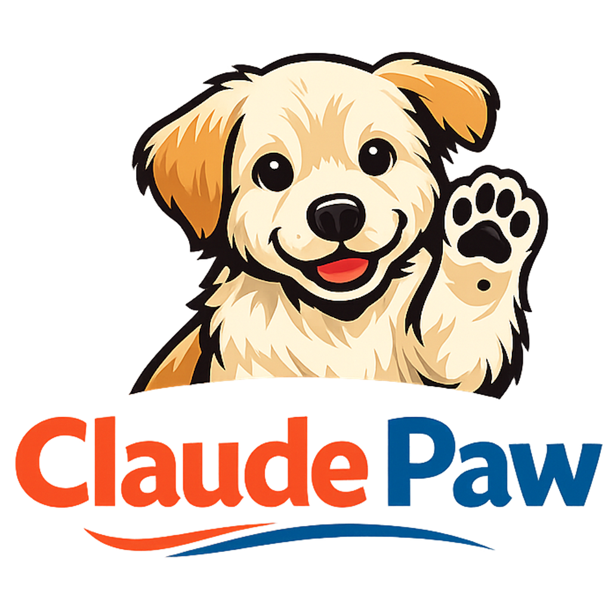

<p align="center">
  
</p>

<h1 align="center">ClaudePaw</h1>

<p align="center">
  <strong>Man's Best Agent</strong><br>
  Your AI. Your Machine. Your Rules.
</p>

<p align="center">
  <em>Turn your Claude Max subscription into a full team of specialized AI agents.</em>
</p>

---

## What Is ClaudePaw

ClaudePaw is a personal AI agent workforce that runs on your Mac. Telegram is the remote control, your Mac runs the agents, a dashboard shows everything in real time. All secured via Tailscale -- nothing touches the public internet.

No API bills. No third-party platforms. Just your $200/mo Claude Max subscription doing the work of an entire team.

## Architecture

```
Tailscale Private Network
├── Mac (ClaudePaw bot)
│   ├── Telegram bot
│   ├── Agent sessions (Claude Code SDK)
│   ├── Memory (SQLite + FTS5)
│   ├── Scheduler (cron-based tasks)
│   └── Voice (STT + TTS)
├── Dashboard Server (Hostinger, Tailscale-only)
│   ├── SPA dashboard (real-time WebSocket)
│   ├── Agent registry + message bus
│   └── Stats collector (YouTube, GA, X/Twitter)
└── GPU Server (Windows/Linux, RTX 4090)
    ├── WhisperX STT
    ├── Chatterbox TTS
    └── Ollama
```

## Agents

ClaudePaw ships with 4 ready-to-use agents and 7 templates you can customize:

### Included Agents

| Agent | Role |
|-------|------|
| **Auditor** | Security -- automated scans, findings triage, remediation |
| **Healer** | Metric monitoring -- health checks, anomaly detection, auto-recovery |
| **Sentinel** | Alert monitoring -- mention tracking, competitor watching |
| **Strategist** | Strategy -- planning, analysis, recommendations |

### Agent Templates (in `templates/`)

Copy any template to `agents/` and customize for your use case:

| Template | Role |
|----------|------|
| **Analyst** | Data interpretation and reporting |
| **Content Creator** | Writing, editing, content pipeline |
| **Critic** | Quality review and feedback |
| **Marketing Lead** | Campaign planning and execution |
| **Orchestrator** | Multi-agent workflow coordination |
| **Researcher** | Deep research and trend analysis |
| **Social Manager** | Social media posting and engagement |

To add a template agent:
```bash
cp templates/analyst.md agents/analyst.md
# Edit the file to customize for your needs
# Add "analyst" to ENABLED_AGENTS in .env
```

### Example Project: Prestige Realty

Check out `projects/prestige-realty/` for a complete example of a real estate agency with 4 custom agents:

| Agent | Role |
|-------|------|
| **Market Scout** | Market research, comps, trend monitoring |
| **Listing Writer** | MLS descriptions, social captions, email drafts |
| **Social Poster** | Social media management across platforms |
| **Deal Analyst** | Financial analysis, offer modeling, ROI calculations |

Use this as a starting point for your own project. Copy the directory and customize the agent prompts for your business.

## Features

- **Action Plan (POAM)** -- agents propose work, you approve. Durable, project-scoped action items with full audit trail. Async human-in-the-loop, items accumulate across hours and days, you work them on your cadence. Five ingestion paths (agent CLI, output parser, Telegram /todo, dashboard, scheduler) and a single approval gate. Auto-archive after 14 days, history preserved forever. See `docs/action-plan-agent-guide.md` for the agent contract.
- **Execution waterfall** -- configure project-scoped primary, secondary, and fallback provider/model stages, with autosaved settings, tier-based model defaults, and telemetry showing requested vs executed provider state
- **Voice-to-voice** -- send a voice note on Telegram, get a voice reply back
- **Agent routing** -- messages automatically route to the right agent based on intent
- **Superpowers harness** -- Builder agent enforces brainstorming, TDD, and code review workflows
- **Architecture memory** -- Builder tracks decisions and tech debt in SQLite
- **Self-improvement** -- Builder can modify ClaudePaw itself with an approval gate
- **Security scans** -- Auditor runs automated npm audit, SSL checks, port scans, secret detection
- **Dashboard** -- real-time cyberpunk-themed SPA with agent status, analytics, action plan, and live feed
- **Scheduled tasks** -- cron-based automation (daily scans, weekly pipelines, trend monitoring)
- **Memory** -- FTS5 search with salience decay across conversation history

## Quick Start

### Prerequisites

- **macOS** (Linux support coming)
- **Node.js 20+** (`node --version`)
- **Claude CLI** installed and authenticated (`claude --version`)
- A **Telegram bot token** (create one at [@BotFather](https://t.me/BotFather))
- Your **Telegram chat ID** (send /start to [@userinfobot](https://t.me/userinfobot))

### Install

```bash
# 1. Clone the repo
git clone https://github.com/Mariano215/claudepaw.ai.git
cd claudepaw.ai

# 2. Install dependencies
npm install

# 3. Run the setup wizard (creates your .env)
npm run setup

# 4. Build
npm run build

# 5. Start
npm run start
```

The setup wizard walks you through configuring Telegram, agents, and optional features (dashboard, voice, social posting). You only need a Telegram bot token and chat ID to get started -- everything else is optional.

### Manual Configuration

If you prefer to skip the wizard:

```bash
cp .env.example .env
```

Edit `.env` and set at minimum:
- `TELEGRAM_BOT_TOKEN` -- your bot token from @BotFather
- `ALLOWED_CHAT_ID` -- your numeric Telegram chat ID

Then `npm run build && npm run start`.

## Guard Sidecar

ClaudePaw includes a Python guard sidecar for the 7-layer prompt-injection defense chain.

- The sidecar manages its own local virtualenv under `guard-sidecar/.venv`, so normal setup does not need `sudo`.
- Repo-local Nova rules are auto-discovered from `guard-sidecar/rules/*.nov`.
- If you want to override the default ruleset, set `NOVA_RULE_PATHS` to a comma-separated list of absolute file paths before startup.

After the sidecar starts, verify it is healthy with:

```bash
curl http://127.0.0.1:8099/health
```

You want `ml_models_loaded: true`. If Nova rules are loaded successfully, `nova_available` will also be `true`.

To validate the repo-local Nova rules against starter attack and benign samples:

```bash
npm run test:guard:rules
```

## Deploy

```bash
# Full pipeline: typecheck, test, build, commit, push, deploy dashboard, restart bot
npm run deploy

# Quick: build, deploy dashboard, restart bot (no tests, no git)
npm run restart

# Dashboard only: sync to Hostinger, rebuild, restart server
npm run deploy:dashboard
```

Normal deploys do not overwrite your live local SQLite files with production copies.

## Dashboard Auth

The dashboard server now expects `DASHBOARD_API_TOKEN` for every `/api/v1` request.

- Production: required. The server refuses to start without it.
- Local development: recommended. If you intentionally want an unsecured local dashboard API, set `ALLOW_UNAUTHENTICATED_DASHBOARD=1` outside production.
- `npm run setup` now generates both `DASHBOARD_API_TOKEN` and `WS_SECRET` automatically for `.env`.
- The browser dashboard receives the token via a same-origin secure cookie; bot-side callers still send `x-dashboard-token` explicitly.

Generate a token manually with:

```bash
openssl rand -hex 32
```

Before deploying to Hostinger, make sure:

- local repo `.env` contains `DASHBOARD_API_TOKEN`
- remote `/opt/claudepaw-server/.env` contains the same `DASHBOARD_API_TOKEN`

Both `scripts/deploy.sh` and `scripts/deploy-dashboard.sh` now abort early if that production requirement is missing.

## Execution Providers

ClaudePaw is optimized for local execution paths first, while still supporting API stages in the fallback chain:

- `claude_desktop` is the default path
- `codex_local` is supported as an alternate local execution provider
- `anthropic_api` and `openai_api` are available as project-scoped API stages when encrypted credentials are configured

Execution settings are defined at the project level and can be overridden per agent. The runtime executes stages in order:

1. primary provider/model
2. secondary provider/model
3. fallback provider/model

If a stage model is left blank, the selected tier supplies the provider default. The runtime records both requested and executed provider state in telemetry so the dashboard can show when fallback occurred.

Database ownership:

- Local bot operational state lives in `store/claudepaw.db`
- Local telemetry lives in `store/telemetry.db`
- Production operational state lives on the dashboard host
- Shared state should sync logically over APIs, not by replacing live SQLite files

Use `npm run db:pull:prod` only to archive production snapshots under `store/prod-snapshots/` for inspection. Use `FORCE_PUSH_PROD_DB=1 npm run db:push:prod` only for an intentional overwrite, and by default it pushes `claudepaw.db` only.

Verification commands:

```bash
npm run provider:readiness
npm run provider:smoke -- --provider claude_desktop
npm run provider:smoke -- --provider codex_local
```

Codex note:

- `codex_local` works when the local Codex CLI is installed and logged in with ChatGPT.
- Verified on April 8, 2026 in a normal terminal: `codex exec` returned successfully with `--output-last-message`.

More detail: `docs/execution-provider-local.md`

If a production SQLite file is ever corrupted, the deployed server includes `server/scripts/repair-sqlite-db.sh`. Run it on the host against the affected file, for example `bash /opt/claudepaw-server/scripts/repair-sqlite-db.sh /opt/claudepaw-server/store/telemetry.db`.

The dashboard server reads Action Plan data from the bot database. In normal repo deployments that file lives at `store/claudepaw.db`; use `BOT_DB_PATH` only when you intentionally keep the bot DB somewhere else.

## Changelog And Releases

For the OSS mirror, this repo uses a lightweight release workflow:

- Record notable user-facing changes in `CHANGELOG.md` under `Unreleased`
- Cut releases periodically, not on every push
- Use tags like `v0.1.0`, `v0.2.0`, `v0.2.1` while the project is still moving fast
- Create a GitHub Release from the tag and reuse the changelog summary

For now, a good rhythm is:

1. Commit and push normally during the day.
2. Keep `CHANGELOG.md` current for meaningful changes.
3. When a milestone feels worth announcing, move `Unreleased` notes into a versioned section and create a tag/release.

See `OSS-RELEASE.md` for a step-by-step release checklist.

## Project Structure

```
src/
├── index.ts          # Entry point + lifecycle
├── bot.ts            # Telegram bot + message handling
├── agent.ts          # Claude Code SDK wrapper
├── agent-router.ts   # Intent-based agent routing
├── souls.ts          # Agent soul loader (reads agents/*.md)
├── db.ts             # SQLite: sessions, memories, tasks
├── memory.ts         # FTS5 search + salience decay
├── voice.ts          # STT (WhisperX) + TTS (Chatterbox)
├── scheduler.ts      # Cron task runner
├── dashboard.ts      # WebSocket client to dashboard server
├── builder/          # Builder agent memory (decisions + tech debt)
└── security/         # Security scanner system

server/
├── src/              # Dashboard server (Express + WebSocket)
└── public/           # Dashboard SPA

agents/               # Agent soul files (.md with frontmatter)
scripts/              # Deploy, restart, CLI tools
```

## License

MIT License. See [LICENSE](LICENSE) for details.

---

<p align="center">
  <sub>Built by <a href="https://matteisystems.com">Mariano Mattei</a> / <a href="https://matteisystems.com">Mattei Systems</a></sub><br>
  <sub>Powered by Claude Code SDK + Telegram + Tailscale</sub>
</p>
